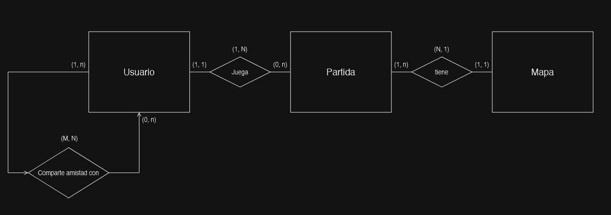
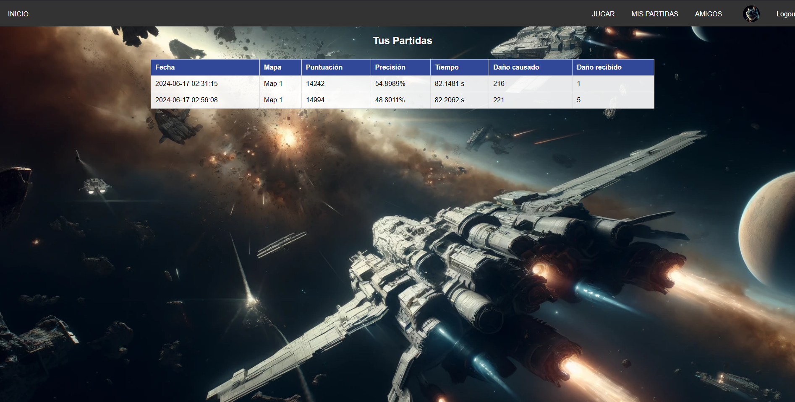

# **DESARROLLO DE VIDEOJUEGO CON SISTEMA DE ESTADISTICAS EN LA NUBE**

## PROYECTO INTEGRADO PARA EL CICLO DE DESARROLLO DE APLICACIONES MULTIPLATAFORMA

### Autor: Sebastían Juan Melgar Marín

## Índice de Contenidos

- [1 - Sobre este proyecto](#1---sobre-este-proyecto)
  - [1.1 - Control de versiones](#11---control-de-versiones)
- [2 - Análisis del problema](#2---análisis-del-problema)
  - [2.1 - Introducción al problema](#21---introducción-al-problema)
  - [2.2 - Antecedentes](#22---antecedentes)
  - [2.3 - Objetivos](#23---objetivos)
  - [2.4 - Requisitos](#24---requisitos)
    - [2.4.1 - Funcionales](#241---funcionales)
    - [2.4.2 - No funcionales](#242---no-funcionales)
  - [2.5 - Recursos](#25---recursos)
    - [2.5.1 - Software](#251---software)
    - [2.5.2 - Hardware](#252---hardware)
- [3 - Diseño de la solución software](#3---diseño-de-la-solución-software)
  - [3.1 - Modelados](#31---modelados)
    - [3.1.1 - Casos de uso](#311---casos-de-uso)
    - [3.1.2 - Diagrama de Secuencia](#312---diagrama-de-secuencia)
  - [3.2 - Prototipado gráfico](#32---prototipado-gráfico)
    - [3.2.1 - Escritorio](#321---escritorio)
  - [3.3 - Base de datos](#33---base-de-datos)
    - [3.3.1 - Diseño Conceptual (ER)](#331---diseño-conceptual-er)
- [4 - Implementación](#4---implementación)
  - [4.1 - Usabilidad](#41---usabilidad)
  - [4.2 - Backend](#42---backend)
  - [4.3 - Frontend](#43---frontend)
  - [4.4 - Pruebas](#44---pruebas)
- [5 - Documentación](#5---documentación)
  - [5.1 - Empaquetado / Distribución](#51---empaquetado--distribución)
  - [5.2 - Instalación](#52---instalación)
  - [5.3 - Manual de Usuario](#53---manual-de-usuario)
    - [5.3.1 - Uso de la página web](#531---uso-de-la-página-web)
    - [5.3.2 - Uso del videojuego DAM WARRIOR](#532---uso-del-videojuego-dam-warrior)
- [6 - Conclusiones](#6---conclusiones)
- [7 - Bibliografía y recursos usados](#7---bibliografía-y-recursos-usados)
- [8 - Anexo de métodos](#8---anexo-de-métodos)

## 1 - Sobre este proyecto

Este proyecto surge como una continuación del desarrollo parcial de un videojuego iniciado como parte del plan de estudios de la asignatura "Horas de libre configuración". En el marco de esta asignatura, enfocada en el desarrollo de videojuegos durante el presente curso escolar, me he propuesto llevar a cabo la expansión y mejora de un emocionante juego de estilo matamarcianos (Shoot'em up).

El videojuego en cuestión se caracteriza por su dinamismo y acción frenética, presentando al jugador un desafío constante mientras avanza en un entorno de scroll lateral. En este universo virtual, el jugador se enfrenta a una sucesión de obstáculos y enemigos que requieren habilidad y destreza para ser esquivados o destruidos, evitando así sufrir daños por colisión o por el impacto de proyectiles enemigos.

El objetivo principal de este proyecto es elevar la experiencia de juego a un nivel superior mediante la implementación de nuevas funcionalidades y la introducción de un sistema de estadísticas que permita al jugador medir su progreso y desempeño de manera significativa. Al abordar estas mejoras, busco no solo enriquecer la jugabilidad del videojuego, sino también explorar y aplicar conocimientos adquiridos en el ámbito del desarrollo de software y diseño de experiencias interactivas.

Imágenes del juego en su estado previo al desarrollo del TFG:


[Probar Dam Warrior en el navegador](https://play.unity.com/mg/other/dam_warrior_web)

[Descargar la build previa del juego](Old_Build/DAM_WARRIOR_BUILD_06_03_2024.rar)

[Descargar la build para el TFG](https://github.com/iesfuengirola1es/proyectointegrado2t2024-Smelgar85/releases/download/FirstRelease/DAM_Warrior_Installer.exe)

### 1.1 - Control de versiones

Se hará control de versiones al código de los scripts de Unity hechos para el videojuego, así como del código que se empleará en desarrollo de la web usando Flask mediante GitHub.

## 2 - Análisis del problema

### 2.1 - Introducción al problema

En el contexto del desarrollo de un videojuego, nos enfrentamos a dos áreas fundamentales que requieren atención: la mejora de la experiencia del jugador a través de la implementación de características básicas faltantes y la integración de un sistema de estadísticas para enriquecer la interacción del jugador con el juego.

Actualmente, el videojuego carece de ciertas funcionalidades que son esenciales para proporcionar una experiencia completa y satisfactoria. La ausencia de un menú de opciones, múltiples mapas, un final apropiado con créditos, transiciones fluidas entre escenarios y una interfaz visualmente atractiva limita el potencial del juego y puede afectar la percepción del jugador sobre su calidad y profesionalismo. Además, la falta de elementos como transiciones de sonido y sucesos coherentes contribuye a una experiencia de juego menos inmersiva.

Por otro lado, la implementación de un sistema de estadísticas permitirá recopilar datos relevantes sobre el desempeño del jugador durante sus partidas. Estadísticas como el daño recibido, el daño infligido, el número de enemigos derrotados, el tiempo total de juego y el porcentaje de aciertos proporcionarán información valiosa tanto para el jugador como para los desarrolladores. Estos datos no solo enriquecerán la experiencia del jugador al ofrecer una mayor comprensión de su progreso y habilidades, sino que también brindarán a los desarrolladores información clave para ajustar y mejorar el juego en futuras iteraciones.

Para abordar estos desafíos, proponemos la ampliación y mejora de las funcionalidades del videojuego, así como la implementación de un sistema de estadísticas basado en Flask que permita la recopilación y visualización de datos de manera eficiente y accesible.

### 2.2 - Antecedentes

El desarrollo de videojuegos es un campo en constante evolución, donde la atención a los detalles y la satisfacción del jugador son cruciales para el éxito de un título. La falta de ciertas funcionalidades básicas y la ausencia de un sistema de estadísticas pueden afectar negativamente la experiencia del jugador y limitar el potencial de un juego para destacarse en un mercado cada vez más competitivo. Reconociendo esta necesidad, mi proyecto se enfoca en abordar estas deficiencias y mejorar la experiencia del usuario.

### 2.3 - Objetivos

El objetivo principal es mejorar la experiencia del jugador mediante la implementación de características faltantes y la integración de un sistema de estadísticas en nuestro videojuego. Específicamente, se busca:

- Ampliar las funcionalidades del juego para incluir un menú de opciones, varios mapas, un final con créditos, transiciones entre mapas y sucesos más coherentes, así como una interfaz más vistosa y transiciones de sonido.

- Implementar un sistema de estadísticas que recoja datos sobre el desempeño del jugador en sus partidas, incluyendo daño recibido, daño infligido, número de enemigos destruidos, tiempo total de partida y porcentaje de aciertos.

### 2.4 - Requisitos

#### 2.4.1 - Funcionales

Los requisitos funcionales incluyen:

- Implementación de un sistema de estadísticas al final de cada mapa para mostrar datos relevantes sobre el desempeño del jugador.
- Implementación de un sistema de consulta de estadísticas de partidas via web, con sistema de registro, sistema de login, registro de partidas, sistema de amigos, etc.
- Creación de un final con créditos para proporcionar un cierre adecuado al juego.
- Diseño de una interfaz de usuario atractiva y visualmente agradable.
- Integración de transiciones fluidas entre mapas y sucesos coherentes para mejorar la inmersión del jugador.
- Implementación de un menú de opciones para permitir al jugador personalizar la configuración del juego.
- Diseño y desarrollo de varios mapas con diferentes niveles de dificultad y desafíos.
- Incorporación de transiciones de sonido para enriquecer la experiencia auditiva del jugador.

#### 2.4.2 - No funcionales

Los requisitos no funcionales incluyen:

- Eficiencia en el rendimiento del juego para garantizar una experiencia fluida.
- Seguridad en el almacenamiento y gestión de datos del jugador.
- Compatibilidad con diferentes dispositivos y sistemas operativos.

### 2.5 - Recursos

#### 2.5.1 - Software

Para el desarrollo de nuestro proyecto, utilizaremos:

- Python y C# como lenguajes de programación principales (para Flask y Unity respectivamente).
- Flask para la implementación del sistema de estadísticas y la interacción con la base de datos.
- Herramientas de desarrollo integradas (IDE) como Visual Studio Code o SublimeText.
- Git para el control de versiones del código fuente.

#### 2.5.2 - Hardware

Los requisitos de hardware para el desarrollo y la ejecución del juego son mínimos y estándar, incluyendo:

- Ordenador con capacidad suficiente para ejecutar el entorno de desarrollo y probar el juego.
- Dispositivos de prueba para garantizar la compatibilidad con diferentes plataformas y sistemas operativos.

## 3 - Diseño de la solución software

### 3.1 - Modelados

#### 3.1.1 - Casos de uso


#### 3.1.2 - Diagrama de Secuencia


### 3.2 - Prototipado gráfico

#### 3.2.1 - Escritorio

DISEÑO WIREFRAME DE LA INTERFAZ WEB:


MOCKUPS DE LA INTERFAZ WEB:


### 3.3 - Base de datos

#### 3.3.1 - Diseño Conceptual (ER)



Las relaciones entre las tablas serían las siguientes:

    Usuario - Amistad:
        La tabla Usuario tiene una relación de uno a muchos (1, N) con la tabla Amistad. Esto significa que cada registro en Usuario puede estar vinculado a muchos registros en Amistad, pero cada registro en Amistad se refiere a exactamente dos usuarios (indicando una amistad).
        La tabla Amistad refleja una relación de muchos a muchos (M, N) entre usuarios porque puede haber muchas instancias de amistad, y cada instancia involucra dos usuarios.

    Usuario - Partida:
        La tabla Usuario tiene una relación de uno a muchos (1, N) con la tabla Partida. Cada usuario puede tener varias partidas asociadas, pero cada partida está asociada a un único usuario (indicado por usuario_id en la tabla Partida).

    Partida - Mapa:
        La tabla Partida tiene una relación de muchos a uno (N, 1) con la tabla Mapa. Muchas partidas pueden tener asociado el mismo mapa (como en diferentes sesiones de juego en el mismo entorno), pero cada partida está vinculada a un único mapa (indicado por mapa_id en la tabla Partida).

    La tabla Amistad actúa como una tabla de asociación para manejar la relación muchos a muchos entre Usuario y Usuario, mientras que la relación entre Partida y Mapa se gestiona directamente a través de la clave foránea mapa_id en la tabla Partida. Con esta configuración, puedes tener muchos usuarios que se hacen amigos entre sí, cada usuario puede jugar muchas partidas y cada partida se lleva a cabo en un solo mapa, que puede ser el escenario de muchas partidas diferentes.

#### 3.3.2 - Modelo relacional


## 4 - Implementación

### 4.1 - Usabilidad

#### <u>A NIVEL WEB</u>:
La página se ha realizado con una interfaz minimalista en mente. Actualmente no existen muchas opciones configurables dentro de la página. La navegación se realiza desde el header superior en el que aparecen las distintas secciones.
Me he inspirado en las páginas de redes sociales, donde normalmente la cuenta de usuario aparece en la parte superior derecha.


#### <u>A NIVEL DE JUEGO</u>:
Se ha procurado que la interfaz sea lo más simple posible. Actualmente el juego no dispone de menú de opciones, por lo que se simplifica aun más la interfaz de usuario y sus opciones.
La interfaz de usuario se puede dividir en menús, y gameplay.

  - ##### MENUS:

    Menú de Login.
En este menú se presentan dos campos de texto, un botón de login centrado y dos pequeños botones en la parte inferior de la pantalla, uno nos lleva a la página web de registro, y el otro nos permite jugar como "invitado".


    Menú principal.
Una vez se ha hecho login (o se ha accedido como invitado) se nos presenta este menú.
En la parte superior derecha podemos ver la cuenta con la que nos hemos logueado, y como opciones tenemos 3: comenzar juego, salir del juego, o desloguearnos.


  - ##### GAMEPLAY:
La interfaz para el juego en sí es bastante simple.
En la parte superior se encuentran el HUD del jugador, y la acción transcurre en toda el área de la pantalla, esto incluye el espacio que hay tras el HUD.


   El HUD se puede dividir en 4 secciones:

   Barra de salud. Esta barra nos indica el nivel de salud que tiene nuestra nave, se divide en 4 segmentos. Cada vez que recibimos daño, perdemos uno de los segmentos (rellenos en rojo).
   Al perder toda la salud, si disponemos de vidas, la barra se rellenará al completo de nuevo.

   

   Barra de vidas. Esta barra nos indica el número de vidas del que disponemos. Se divide en 3 segmentos, por defecto comenzamos con los 3 segmentos ocupados por iconos esféricos que simbolizan cada vida. En caso de que lleguemos a perder toda la salud, perderemos una vida.
   En caso de que perdamos todas las vidas, comenzará el nivel desde el principio.

   

   Barra de poder. Esta barra se rellena a medida que acertemos nuestros disparos sobre los enemigos, una vez rellena, podremos usar el disparo especial.

   

   Contador de puntuación. En este contador se muestra nuestra puntuación en tiempo real. Cada vez que alcancemos un objetivo, dependiendo del que sea, obtenemos una serie de puntos.

   

#### <u>UX EXPERIENCIA DE USUARIO</u>

  Los controles se han hecho de manera que sean sencillos de usar en PC. La configuración de teclas es clásica para juegos actuales. Usando la configuración WASD para el movimiento de la nave, ESPACIO para el disparo y CONTROL izquierda para el disparo especial.
  Con algo de práctica incluso se puede jugar con una sola mano, pero lo más cómodo es usar la mano derecha para controlar el disparo, y la mano izquierda para movernos y el disparo especial.
  Otras configuraciones se probaron por simple curiosidad, pero ésta fue la más cómoda, aunque es una cuestión subjetiva y lo ideal será implementar un sistema de control configurable por el usuario.
  También se ha implementado control mediante gamepads. Se ha intentado armonizar ambos tipos de control, aunque, personalmente, prefiero el control mediante teclado.
  

### 4.2 - Backend

#### Descripción

El backend de la aplicación está desarrollado utilizando Flask, un microframework de Python. Este servidor se encarga de manejar las peticiones, gestionar las bases de datos, autenticar usuarios, y proporcionar una API para la comunicación con el cliente (el videojuego de Unity).

El backend sigue una arquitectura prácticamente monolitica y utiliza SQLAlchemy como ORM para interactuar con la base de datos. La base de datos está alojada en MySQL en PythonAnywhere. El sistema de autenticación utiliza hashes de contraseña seguros y sesiones para mantener a los usuarios autenticados.

#### API

El backend expone varios endpoints para interactuar con la aplicación web y con el juego de Unity. A continuación, se detallan los endpoints más importantes:

    Registro de Usuarios:
        Endpoint: /register
        Método: POST
        Descripción: Permite a los nuevos usuarios registrarse en la plataforma.
        Parámetros: nombre_usuario, email, contrasena
        Respuesta: Mensaje de éxito o error.

    Inicio de Sesión:
        Endpoint: /login
        Método: POST
        Descripción: Autentica a los usuarios y establece una sesión.
        Parámetros: nombre_usuario, contrasena
        Respuesta: Redirige al dashboard en caso de éxito, mensaje de error en caso de fallo.

    Guardar Estadísticas:
        Endpoint: /guardar_estadisticas
        Método: POST
        Descripción: Recibe las estadísticas del juego desde Unity y las almacena en la base de datos.
        Parámetros: username, password, stats (JSON con las estadísticas de la partida)
        Respuesta: Mensaje de éxito o error.

    Dashboard:
        Endpoint: /dashboard
        Método: GET
        Descripción: Muestra el panel principal del usuario con sus mejores partidas.
        Parámetros: Ninguno.
        Respuesta: Renderiza la plantilla dashboard.html con la información del usuario.

    Perfil de Usuario:
        Endpoint: /perfil
        Método: GET, POST
        Descripción: Muestra y permite editar el perfil del usuario.
        Parámetros: nombre_usuario, email (para actualizar), accion (para determinar la acción a realizar)
        Respuesta: Renderiza la plantilla perfil.html con la información del usuario.

#### Seguridad

El backend utiliza hashes de contraseñas seguros generados con werkzeug.security.generate_password_hash y check_password_hash para la autenticación de usuarios. Si bien las comunicaciones entre el servidor y el cliente. Además, todas las comunicaciones entre el cliente y el servidor están protegidas mediante HTTPS en PythonAnywhere.

#### <u>Código de Ejemplo</u>

Aquí se muestra un ejemplo de cómo se guardan las estadísticas de una partida desde Unity al servidor Flask:

##### Código en Unity (ScoreManager.cs):

1. Preparación de los Datos en Unity.

    En Unity, se deben recolectar las estadísticas del juego y convertirlas en un formato que se pueda enviar fácilmente a través de una solicitud HTTP, en nuestro caso, hemos escogido JSON.

    ```csharp
    public void SaveGameStatistics()
    {
        // Creamos una instancia de GameStatistics con los datos del juego
        GameStatistics stats = new GameStatistics(
            DateTime.Now,
            mapName,
            score,
            totalShots > 0 ? (float)shotsHit / totalShots : 0,
            Time.time - startTime,
            damageDealt,
            damageTaken
        );

        // Se convierten las estadísticas a JSON
        string json = JsonUtility.ToJson(stats);
        
        //Guardamos las estadísticas localmente usando PlayerPrefs
        PlayerPrefs.SetString("ultimaPartida", json);
        PlayerPrefs.Save();
        
        // Se envían las estadísticas al servidor siempre y cuando el usuario no sea "guest"
        string username = PlayerPrefs.GetString("username", "guest");
        if (username != "guest")
        {
            StartCoroutine(SendStatisticsToServer(json, username, PlayerPrefs.GetString("password")));
        }
    }
    ```

2. Enviar los Datos desde Unity a Flask.

    Se utiliza una corrutina en Unity para enviar los datos a través de una solicitud HTTP POST. Esto permite manejar la solicitud de forma asíncrona sin que el juego se bloquee.

    ```csharp
    private IEnumerator SendStatisticsToServer(string json, string username, string password)
    {   
        // Creamos un formulario para la solicitud POST que enviar al servidor
        WWWForm form = new WWWForm();
        form.AddField("username", username);
        form.AddField("password", password);
        form.AddField("stats", json);

        // Aquí enviamos la solicitud POST al servidor Flask
        using (UnityWebRequest www = UnityWebRequest.Post("http://smelgar85.eu.pythonanywhere.com/guardar_estadisticas", form))
        {
            yield return www.SendWebRequest();

            // Comprobamos la respuesta del servidor (solo para debug)
            if (www.result != UnityWebRequest.Result.Success)
            {
                Debug.LogError("Error al enviar las estadísticas: " + www.error);
            }
            else
            {
                Debug.Log("Estadísticas enviadas correctamente");
            }
        }
    }
    ```

##### Código en Flask (app.py):

3. Recepción de los Datos en Flask.

    En el servidor Flask, se configura un endpoint para recibir la solicitud POST con las estadísticas del juego.

    ```python
    @app.route('/guardar_estadisticas', methods=['POST'])
    def guardar_estadisticas():
        username = request.form['username']
        password = request.form['password']
        stats_json = request.form['stats']

        # Buscamos el usuario en la base de datos
        user = Usuario.query.filter_by(nombre_usuario=username).first()
        if not user or not check_password_hash(user.contrasena, password):
            return jsonify({'status': 'error', 'message': 'Usuario o contraseña incorrectos'}), 401
        
        # Convertimos el JSON de estadísticas en un diccionario
        stats = json.loads(stats_json)

        # Se crea una nueva instancia de Partida con los datos recibidos
        partida = Partida(
            usuario_id=user.id,
            mapa_id=1,  # Esto (y lo que conlleva) habrá que modificarlo si se añaden mapas adicionales
            fecha=datetime.datetime.strptime(stats['fecha'], '%Y-%m-%d %H:%M:%S'),
            puntuacion_destruccion=stats['puntuacion'],
            estadisticas_precision=stats['precision'] * 100,
            tiempo_completado=stats['tiempoCompletado'],
            dano_recibido=stats['danoRecibido'],
            dano_infligido=stats['danoCausado']
        )

        # Se guarda la partida en la base de datos
        db.session.add(partida)
        db.session.commit()

        return jsonify({'status': 'success', 'message': 'Estadísticas guardadas correctamente'})
    ```

Esta integración asegura que las estadísticas de las partidas jugadas en Unity se guarden de forma segura y se puedan consultar a través de la página web en PythonAnywhere.

### 4.3 - Frontend

- Frontend del Juego en Unity

  Frameworks y Bibliotecas: El juego ha sido desarrollado en Unity, utilizando TextMeshPro para la visualización de texto.

  Componentes del Juego: El juego se estructura en varios componentes, cada uno gestionando diferentes aspectos del juego, como la gestión de puntuaciones (ScoreManager.cs), la visualización de estadísticas (ResumenPartida.cs), y la comunicación con el servidor (GameStatistics.cs). Para ver el listado completo de componentes, ver [ANEXO DE MÉTODOS](ANEXO_METODOS.md)

  Comunicación con el Backend: La comunicación entre el juego y el backend se realiza mediante solicitudes HTTP. Los datos de las estadísticas del juego se envían al servidor Flask utilizando UnityWebRequest en forma de Json.

- Frontend de la Web con Flask

  Framework y Templates: Flask se utiliza como framework para renderizar las páginas web. Las plantillas HTML están organizadas y utilizan el motor de plantillas Jinja2 para insertar los datos.

  Estilos y Diseño: El diseño de las páginas web utiliza CSS para establecer los estilos, estando éstos embebidos en los propios html.

### 4.4 - Pruebas

Lamentablemente no he podido realizar pruebas unitarias de ninguna de las dos partes del proyecto, tanto el servidor Flask como el videojuego en Unity.

Las únicas pruebas que se han realizado son pruebas de usuario, realizadas tanto por mi como por amigos y conocidos.

## 5 - Documentación

### 5.1 - Empaquetado / Distribución
Se ha usado Inno Setup Compiler para generar un instalador de la aplicación.


### 5.2 - Instalación
El proceso de instalación es muy sencillo.
1. Ejecutamos el instalador DAM_WARRIOR_Installer.exe

      

2. Seleccionadmos el idioma del instalador

      

3. Seleccionamos si deseamos incluir un acceso directo en el escritorio

      
4. Pulsamos instalar y comenzará la instalación. La ruta de instalación es C:\Program Files (x86)\DAM WARRIOR
      

5. Por último podemos cerrar el instalador escogiendo si ejecutar el juego
      

### 5.3 - Manual de Usuario

#### 5.3.1 - Uso de la página web

La página web, alojada en [http://smelgar85.eu.pythonanywhere.com](http://smelgar85.eu.pythonanywhere.com) nos permite registrarnos. loguearnos, llevar un registro de partidas y puntuaciones tanto nuestras como de otros usuarios.

- Página de inicio

En esta página podremos hacer login si disponemos de una cuenta.
Disponemos de dos campos de texto que rellenar con nuestro nombre de usuario y nuestra contraseña. En caso de no tener cuenta, o de introducir credenciales erróneas, un mensaje de error nos advertirá de ello.
Para registrarnos, podemos hacer click tanto en la parte inferior del recuadro de Login como en la parte superior derecha de la página.

    

- Página de registro

En esta página podremos registrar una nueva cuenta de usuario. Solo tenemos que introducir un nombre de usuario, un email válido y una contraseña. En caso de que el formato de email no sea válido no podremos crear nuestra cuenta.
Tampoco podremos crear una cuenta en caso de que ya exista el nombre de usuario.

- Página principal, o Dashboard

En esta página se nos muestra de primeras una tabla de puntuaciones de usuarios, donde podremos ver las mejores puntuaciones conseguidas en el juego. Desde esta página podremos acceder a todas las distintas secciones.
En la parte superior derecha tenemos las secciones "JUGAR", "MIS PARTIDAS", "AMIGOS", nuestra imágen de perfil (que nos llevará a nuestro perfil) y el botón de "LOGOUT", que cerrará nuestra sesión.


- Página JUGAR

Esta página nos muestra el proyecto exportado como WebGL a Unity Play. Al hacer click en "Play" nos llevará a la página de Unity Play donde podremos jugar. Actualmente la versión web carece de funcionalidad de estadísticas por causas ajenas.

- Página MIS PARTIDAS

En esta página se nos muestra una tabla con un listado de nuestras partidas, ordenadas por fecha.

- Página AMIGOS

En esta página podremos ver nuestro listado de amigos, y podremos agregarlos a nuestra lista introduciendo el nombre del usuario y pulsando en el botón "Agregar Amigo".
También tenemos la opción de borrar amigos, pulsando en el botón "Eliminar amigo" situado a la derecha de cada usuario.

- Página de perfil

En esta página podremos cambiar nuestro nombre de usuario e Email de contacto. Simplemente debemos cambiar nuestro nombre de usuario e email, y en caso de que el nombre de usuario esté disponible, y que la dirección de email tenga un formato correcto, se efectuará el cambio.
También podemos borrar nuestro listado personal de partidas, y borrar nuestra cuenta de usuario.

#### 5.3.2 - Uso del videojuego DAM WARRIOR

- Menú de Login

En esta pantalla podemos acceder al juego logueandonos, solo tenemos que introducir el nombre de usuario, la contraseña en sus respectivos campos de texto y pulsar el botón LOGIN.
Si todo ha ido bien, se pasará a la siguiente pantalla.
En caso de que algo haya ido mal, o el usuario/contraseña sean erróneos, se nos mostrará un mensaje de error bajo el botón de login.

  

  También disponemos de dos botones en la parte inferior de la pantalla.
  El botón "PLAY AS GUEST", situado en la parte inferior derecha nos permite pasar a la página principal del juego sin loguearnos. En caso de que se elija esta opción, igualmente se nos mostrarán las estadísticas al final de la partida, simplemente no quedarán registradas en la página web.
  
  

  El otro botón, en la parte inferior izquierda y llamado "DON'T HAVE AN ACCOUNT?" nos llevará a la página web de registro.

  

- Menú principal

Este menu dispone de 3 botones. "START GAME", que comenzará la partida, "EXIT GAME" que cerrará el juego, y "LOGIN" en caso de jugar como Guest o invitado, o "LOGOUT" en caso de que hayamos hecho login en el menú de login. En ambos casos al pulsar este botón, se nos lleva al menú de login visto anteriormente.
En la parte superior derecha se nos indica el nombre de usuario con el que nos hemos logueado.

- Pantalla de juego

Este es el aspecto de nuestra pantalla de juego. El objetivo es sencillo: llegar al final, matar al boss y no morir en el intento.
Para ello nos moveremos con las teclas W, A, S, D, dispararemos con la tecla ESPACIO y lanzaremos nuestro ataque especial con la tecla CONTROL izquierda.
En la parte superior tenemos el HUD, que nos muestra información de diversa índole.
El HUD se puede dividir en 4 secciones:

   Barra de salud. Esta barra nos indica el nivel de salud que tiene nuestra nave, se divide en 4 segmentos. Cada vez que recibimos daño, perdemos uno de los segmentos (rellenos en rojo).
   Al perder toda la salud, si disponemos de vidas, la barra se rellenará al completo de nuevo.

   

   Barra de vidas. Esta barra nos indica el número de vidas del que disponemos. Se divide en 3 segmentos, por defecto comenzamos con los 3 segmentos ocupados por iconos esféricos que simbolizan cada vida. En caso de que lleguemos a perder toda la salud, perderemos una vida.
   En caso de que perdamos todas las vidas, comenzará el nivel desde el principio.

   

   Barra de poder. Esta barra se rellena a medida que acertemos nuestros disparos sobre los enemigos, una vez rellena, podremos usar el disparo especial.

   

   Contador de puntuación. En este contador se muestra nuestra puntuación en tiempo real. Cada vez que alcancemos un objetivo, dependiendo del que sea, obtenemos una serie de puntos.

   

- Resumen de partida

Aquí se nos presentan las estadísticas de la partida.

  DATE: la fecha y hora de finalización de la partida.

  MAP: el nombre del mapa que hemos jugado.

  SCORE: la puntuación obtenida.

  ACCURACY: la precisón obtenida a lo largo de la partida, esta cifra será el resultado del número de disparos efectuados y el número de estos disparos que han alcanzado un objetivo. Si quieres tener alta puntuación, vigila cuando disparas.

  DAMAGE TAKEN: número de puntos de daño que hemos perdido. Lo ideal es acabar la partida con 0, significa que hemos hecho un perfect.

  DAMAGE DONE: el número de puntos de daño que hemos hecho en total.

  TIME: el tiempo total que ha llevado terminar la partida.

## 6 - Conclusiones

Creo que he cumplido con el objetivo principal que me marqué a la hora de plantear el proyecto y que da título a este TFG, si bien al final no he podido implementar ciertas características que planee en un principio, como son el añadir un pequeño menú de opciones para controlar el nivel de sonido y otras opciones.

Mi objetivo principal era conseguir conectar Unity con una página web que mostrase las estadísticas de cada usuario, usando un sistema de login para cada usuario.
Creo que dicho objetivo ha sido cumplido con creces, <b>sin embargo hay muchísimas características que planeo implementar a posteriori, como son:</b>

#### Flask

- Implementar un sistema de imágenes de perfil para que cada persona pueda subir su propia imágen

- Implementar un sistema de confirmación de cuenta, que envíe un email al usuario con una URL de activación, y que sólo registre el usuario en caso de que efectivamente se acceda a esa URL

- Implementar el cambio de contraseña, es algo que debería haber hecho desde un principio, pero fui retrasando su implementación y no he podido completarlo a tiempo.

- Implementar un sistema de solicitudes de amistad, esto implicaría modificar la base de datos y añadir un campo de "amistad efectiva" en caso de que la otra persona acepte la solicitud

#### Unity

  - Añadir más mapas, con más enemigos y bosses. Tengo varios assets ya desarrollados para ese fin.

  - Añadir una pantalla de selección de naves, la idea es que cada vez que se derrote una nave "convencional", ese modelo de nave se pueda usar como nave principal

  - Añadir algo de historia, la intención es añadir un sistema de viñetas muy simple que muestre imágenes con una narración antes de comenzar cada mapa, y quizá antes de enfrentarse al boss

  - La transición entre escenas: en algunas he conseguido crear un efecto Fade Out a negro y aplicarlo al pasar de una escena a otra, pero en otras escenas no he podido por lo que sospecho es un problema de layers

  - Añadir opciones de sonido, controles y un selector de dificultad.

  - Añadir menú de pausa que permita salir de la partida

  - Añadir un sistema de "Continue" estilo máquinas arcade, con una cuenta atrás, para comenzar de nuevo o para salir al menú principal

## 7 - Bibliografía y recursos usados

- [Stack Overflow](https://stackoverflow.com/): Un pilar indispensable en la realización de este proyecto gracias a las contribuciones de sus usuarios.
- [ChatGPT](https://chatgpt.com): En más de una ocasión, cuando me he atascado o directamente no sabía qué estaba buscando, ha sabido orientarme.
- [Documentación de Unity](https://docs.unity3d.com): Una página esencial para comprender cómo funciona Unity.
- [Educación a Distancia - Junta de Andalucía](https://educacionadistancia.juntadeandalucia.es/): La Moodle del centro IES Fuengirola Nº1. En concreto los manuales de Flask del curso 2023/2024.

## 8 - ANEXO DE MÉTODOS

[Ver anexo de métodos](ANEXO_METODOS.md)